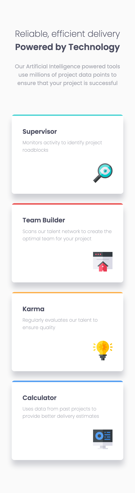
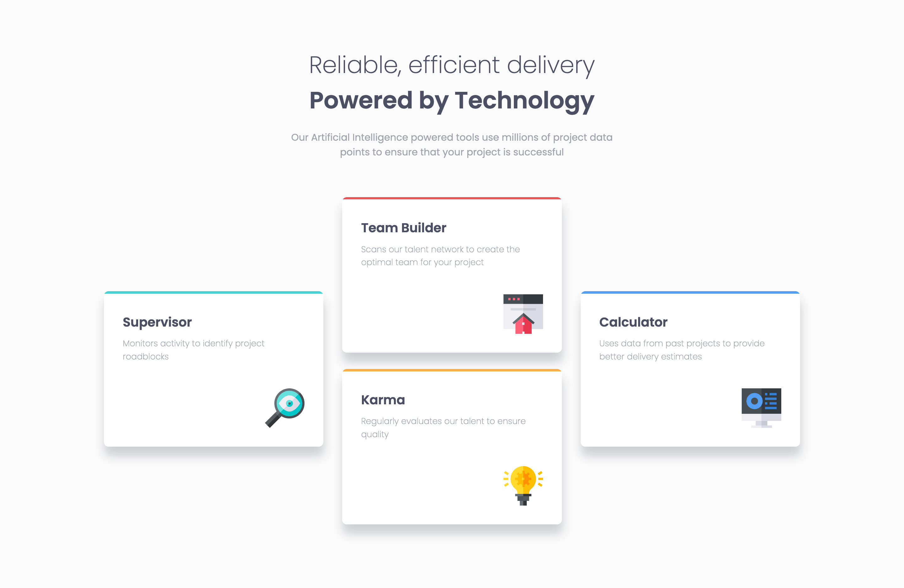

# Frontend Mentor - Four card feature section solution

This is a solution to the [Four card feature section challenge on Frontend Mentor](https://www.frontendmentor.io/challenges/four-card-feature-section-weK1eFYK). Frontend Mentor challenges help you improve your coding skills by building realistic projects. 

## Table of contents

- [Overview](#overview)
  - [The challenge](#the-challenge)
  - [Screenshot](#screenshot)
  - [Links](#links)
- [My process](#my-process)
  - [Built with](#built-with)
  - [What I learned](#what-i-learned)
- [Author](#author)

## Overview

### The challenge

Users should be able to:

- View the optimal layout for the site depending on their device's screen size

### Screenshot




### Links

- Solution URL: [Github](https://github.com/erelita/four-card-feature-section.git)
- Live Site URL: [Github Pages](https://erelita.github.io/four-card-feature-section/)

## My process

### Built with

- Semantic HTML5 markup
- CSS custom properties
- Flexbox
- Mobile-first workflow

### What I learned

I used CSS flexbox in this challenge. I can't think of a way of doing the desktop layout other than dividing the four cards into three columns.

```html
<div class="cards-container">
  <!-- COLUMN ONE -->
  <div class="cards-container__column">
    <!-- SUPERVISOR -->
    <div class="card-container">
    </div>
  </div>
  <!-- COLUMN TWO -->
  <div class="cards-container__column">
    <!-- TEAM BUILDER -->
    <div class="card-container">
    </div>
    <!-- KARMA -->
    <div class="card-container">
    </div>
  </div>
  <!-- COLUMN THREE -->
  <div class="cards-container__column">
    <!-- CALCULATOR -->
    <div class="card-container">
    </div>
  </div>
</div>
```

Then I targeted the odd numbered columns to set their align-self to center using CSS flexbox. This is my first time using the nth-child and I am happy that it executed well with this layout.

```css
.cards-container__column:nth-child(odd) {
  align-self: center;
}
```

Using the border-top on the cards didn't work well since the cards have rounded corners and the border followed the rounded corners instead of just going in a straight line, so I used span and made it into a block. And for the different colors, I added a decorative class for each border.

I'm not sure if naming them with numbers is okay, but I thought if the colors were to be changed, then the class name can be retained.

```css
.card-container__border {
    display: block;
    height: 0.25em;
}

.border--one {
    background-color: var(--clr-primary-cyan);
}

.border--two {
    background-color: var(--clr-primary-red);
}

.border--three {
    background-color: var(--clr-primary-orange);
}

.border--four {
    background-color: var(--clr-primary-blue);
}
```

I try to be descriptive in naming each class/id so it'll be easier to understand by others, but most of my time in the beginning of doing the project is spent on it >.< I hope to improve on it, as well, in the future.

## Author

- Github - [Erelita](https://github.com/erelita)
- Frontend Mentor - [@erelita](https://www.frontendmentor.io/profile/erelita)
